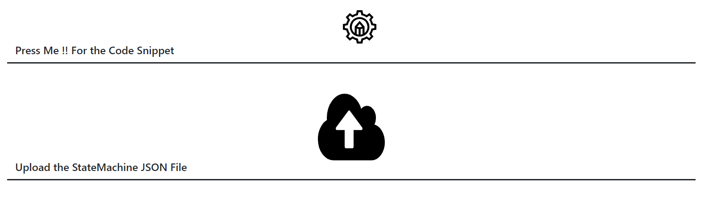

# PyAAAS_StateMachineCreator
## Dependencies

This repository hosts the source code for State Machine Creator, 

:one: The  code is written in Python 3.9 <br />
:two: All the Python dependencies are specified in the [requirements.txt](https://github.com/harishpakala/PythonAASxServer/blob/master/requirements.txt) <br />
:three: The LIA OVGU development uses eclipse editor, accordingly eclipse related project files are provided in the repository.

### Installing Dependencies
<strong>pip3 install -r requirements.txt</strong> <br/>

## Running 
1) The base python program app.py is organized inside the root directory.  <br/>
<strong>python3.9 app.py</strong> <br/>

2) WEB UI for the state machine creator. The port number can be chaanged directly in the source-code app.py at the line no. 90
   <http://localhost:50008/>

## Create a new Finite State Machine
A Custom state-machine representation in json format is designed for creating the actual source-code. The sample state-machine representations are provided in the [examples sub-directory](https://github.com/harishpakala/PyAAAS_StateMachineCreator/tree/main/examples). 


<p align="center">
The Web UI for the state machine creator
</p>

The JSON file needs to be upload via the ulpoad image button, once finished the generate button on the top needs to be clicked. In case the JSON file properly formatted the a python source code for the state machine represented will be downloaded automatically.

The generated python source-code needs to be placed in the sub-directory (src/main/skills) of the PythonAASxServer [source code](https://github.com/harishpakala/PythonAASxServer).

## Sample State
```
class Hello(AState):
    message_in =  ["Ping",]       
    
    def initialize(self):
        # Gaurd variables for enabling the transitions
        self.SendAck_Enabled = True 
            
    def actions(self) -> None:
        if (self.wait_untill_timeout(10)):
            message = self.receive(WaitforHi.message_in[0])
            self.save_in_message(message)
        
    def transitions(self) -> object:
        if (self.SendAck_Enabled):
            return "SendAck"
```
<p align="center">
A Hello state formatted as per Pyhton AASxServer and the StateMachine creator.
</p>

* The Hello state inherits the class Abstract class <strong>AState</strong> [source-code](https://github.com/harishpakala/PythonAASxServer/blob/c308300e3e78dbac5cacbbf6c09fc526a4d52eff/src/main/utils/sip.py#L43). 
* This class provides a set of guard conditions reequired for transitions to the next state. All the logic to the be executed within the Hello state needs to be written in the <strong>actions()</strong> method.
* The <strong>transitions()</strong> method should not be edited.
* For every next state a boolean guard variable will be provided in the constructor of the class, extracted from the JSON file. All the guard variables are defaulted to True.
* The developer needs to disable gaurd variable (False) in the <strong>actions()</strong> method, for the state that is not the next one.

### Predefined guard functions
```
wait_untill_timeout(timer) --> The Control waits untill a specific number of seconds as assigned to argument to the method.
```
<br/>
```
wait_untill_message(message_count,msg_types) --> The Control waits untill a specific number of messaages are arrived in the buffer of the message type specified as an argument msg_types (List of strings).
```
<br/>
```
wait_untill_message_timeout(message_count,timer,msg_types) --> The Control waits untill a specific number of messaages are arrived in the buffer of the message type specified as an argument msg_types (List of strings). However if the timer expires, the control return
```


## Issues
If you want to request new features or report bug [submit a new issue](https://github.com/harishpakala/PyAAAS_StateMachineCreator/issues/new)

## License

Python AAS Registry is Licensed under Apache 2.0, the complete license text including the copy rights is included under [License.txt](https://github.com/harishpakala/PythonAASxServer/blob/main/LICENSE.txt)

* Flask, Flask-RESTful, BSD-3-Clause <br />
* pybars3 GNU Lesser General Public License, Version 3 <br />
